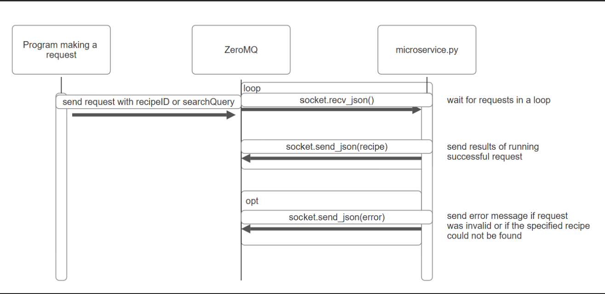

# microservice-a

**Instructions for requesting data from the microservice:**
- Requests to the microservice are made in JSON format and use ZeroMQ as a communication pipe, for example:
  - socket.send_json({"recipeID": "2"}) would tell the microservice to fetch the recipe with ID 2
  - socket.send_json({"searchQuery": "pasta"}) would tell the microservice to search for recipes whose name or ingredients list contains the word 'pasta'

**Instructions for receiving data from the microservice:**
- Receiving data from the microservice can be done like so:
  - socket.recv_json() 
  - This call tells the microservice to send a JSON response, which is automatically parsed.
  - For calls that are valid, this will return either the recipe corresponding to recipeID or a list of recipes that match the searchQuery.

UML sequence diagram:
